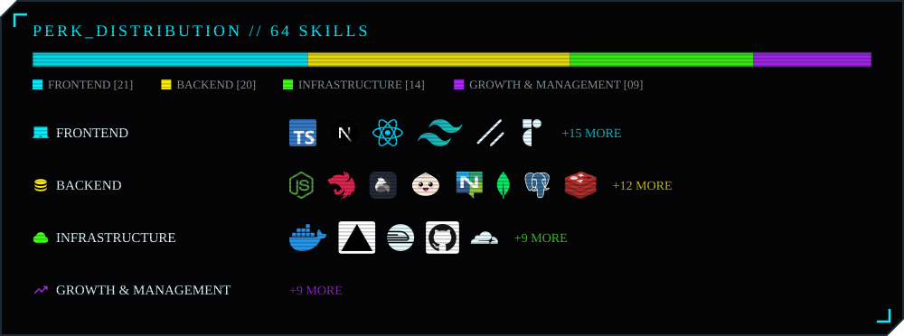
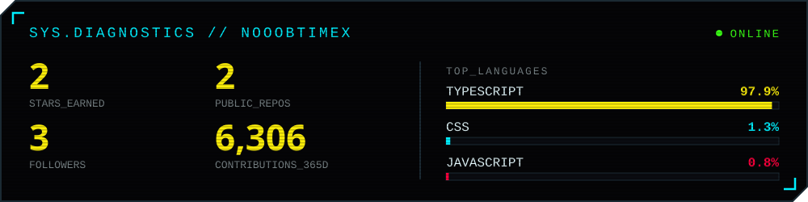
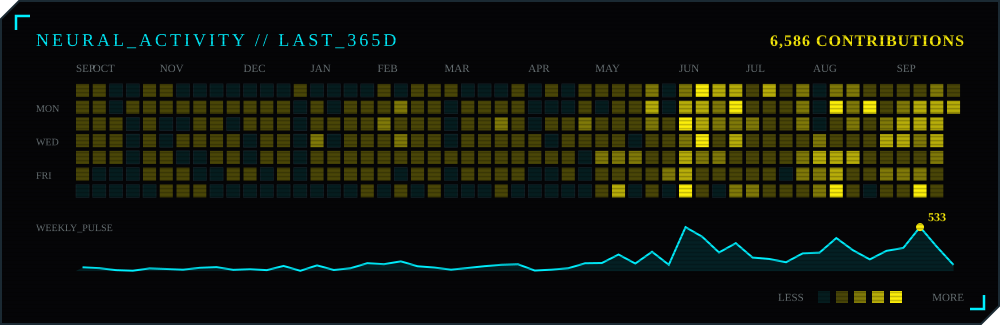

<!-- All visuals are self-generated SVGs — see scripts/readme/ (bun run readme:assets). -->
<!-- Stats refresh daily via .github/workflows/readme-assets.yml -->

<!-- 00 // IDENTITY -->

**Freelance software engineer building production web apps end to end —
scope, UI, API, database and deploy.**

⚡ This repo is the source of my Cyberpunk-2077-themed profile → **[nooobtimex.me](https://nooobtimex.me)** · hire me on **[Fastwork](https://fastwork.co/byob/DJpB7L1xWm?openExternalBrowser=1)**

 

<!-- 01 // CAREER_TRACE -->

<!-- 02 // GIGS -->

<!-- 03 // ARSENAL -->

<!-- 04 // GITHUB_FEED -->

<!-- 05 // COMMS -->

**Hire me for a web app → [Fastwork](https://fastwork.co/byob/DJpB7L1xWm?openExternalBrowser=1)**

 
 

<code>// EOF — WAKE UP, SAMURAI. THERE'S CODE TO WRITE.</code>

